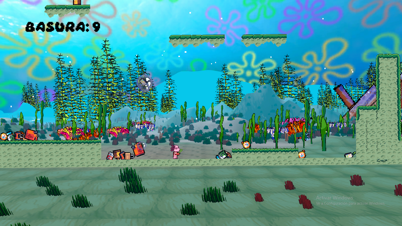

# GGJ2025-BUBBLE-

Bioremediation Pop es un prototipo de videojuego creado en la Global Game Jam 2025 con el tema Burbuja y el subtema de sede, objetivos de desarrollo sostenible. Trata de un Ajolote que limpia las aguas con una jabolina.

